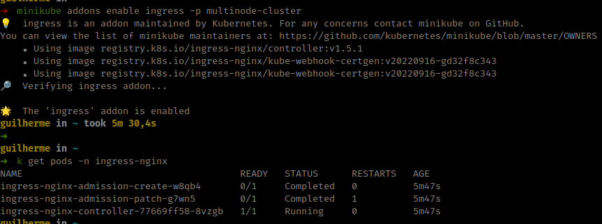

# Setup local machine for testing

Setup local machine with minikube cluster and automation settings

## Description

The propose project is create a simple environment for testing

* [Link](https://kubernetes.io/docs/reference/networking/ports-and-protocols/) Kubernetes ports and protocol

### K8s

* Cluster with control-plane and nodes

## Getting Started

### Dependencies

* kubectl.

### Installing

* [Link](https://gist.github.com/guilhermelinhares/c06853c0565c1b02f4c98b1c209e13a4) Install Kubectl
* [Link](https://minikube.sigs.k8s.io/docs/start/) Install minikube

### Executing K8s

* Start your cluster - VirtualBox

From a terminal with administrator access (but not logged in as root), run:

```
minikube start --nodes 2 --driver=virtualbox -p multinode-cluster
```

* Enable the Ingress controller

```
minikube addons enable ingress -p multinode-cluster
```

* Verify that the NGINX Ingress controller is running

```
kubectl get pods -n ingress-nginx
```

* Verify that the NGINX Ingress controller is running

```
kubectl get pods -n ingress-nginx
```



* Create a example Nginx Ingress

```
kubectl apply -f nginx-ingress-example.yaml
```